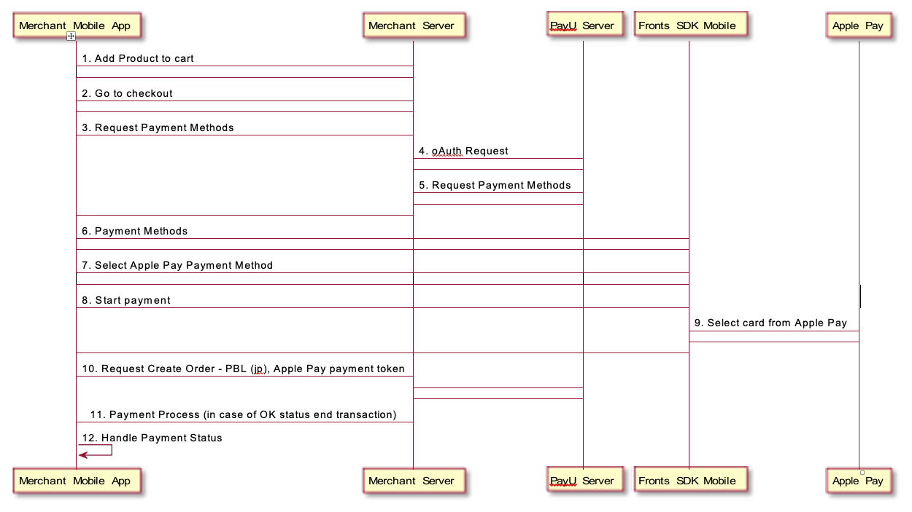

## Apple Pay


### Introduction

Apple Pay™ is a digital wallet which lets you make card payments in a simple and fast manner, without having to enter your card details every time. The card data is securely stored by Apple. This payment method is available for selected browsers and Apple devices (phones and computers). A full list of [supported countries](https://www.apple.com/ios/feature-availability/#apple-pay) and [devices](https://support.apple.com/en-us/HT208531) can be found on the Apple website. 


### PayU Support

POS with enabled Apple Pay payment method is required for both sandbox (testing) and production (real transactions) environment. **Contact PayU support to enable Apple Pay payments on your POS for each environment: itsupport@payu.pl**


### Configuration

To support Apple Pay payments in your own mobile app or on a website, you first need an Apple Development Account and apply for Apple Developer Program. The approval time may take several days, as mentioned on [Initiating Apple Pay](https://developer.apple.com/documentation/businesschatapi/messages_sent/interactive_messages/apple_pay_in_business_chat/initiating_apple_pay). Next you should perform the following actions:
- create a Merchant ID,
- create an Apple Pay Payment Processing Certificate
- enable Apple Pay in XCode project


#### Creating a Merchant ID

To create a Merchant ID, follow these steps:
- Log on to your Apple Developer account.
- Select Certificates, IDs & Profiles.
- Select Identifiers.
- Add a new Merchant ID by selecting the + sign in the top right of the screen.
- Enter an ID and description, and select Continue.
- Select Register to confirm the data entered.


#### Creating an Apple Pay Payment Processing Certificate

> **Before creating certificate please contact us and ask for CSR file which is required in below process**

To create a Payment Processing Certificate identifier, follow these steps:
- Log on to your Apple Developer account.
- Select Certificates, IDs & Profiles.
- Select Identifiers.
- Select the Merchant ID that you have created, and select Edit. You can make your search easier by using the Merchant IDs filter at the top right of the screen.
- In the Apple Pay Payment Processing Certificate section, select Create Certificate.
- On the next screen select Continue.
- Take received CSR file from the PayU IT support department and upload it to the site, selecting Choose File and then Continue.
- Download the generated certificate.
- Send the downloaded certificate (the file `apple_pay.cer`) to the [PayU IT support department](tech@payu.pl).


#### Enable Apple Pay in XCode project

Apple Pay Programming Guide: [Configuring Your Environment](https://developer.apple.com/library/archive/ApplePay_Guide/Configuration.html)


### Sandbox

The Apple Pay payment method is also available in a sandbox environment. In the integration process, we suggest creating an independent Merchant ID (with a name ending “.test”, for example) together with a set of certificates.

Because Apple Pay is not the default payment method, please contact the [PayU IT support department](tech@payu.pl) after registering in the sandbox environment, but before beginning integration using the Apple Pay payment method. In response you receive also CSR file for Sandbox environment.

Before beginning to perform tests in the sandbox, please also read the [Apple sandbox testing instructions](https://developer.apple.com/apple-pay/sandbox-testing/).

We recommend using the card numbers:
- `5204 2477 5000 1471`
- `4761 1200 1000 0492`

since these are configured in the PayU sandbox to enable payments to be completed successfully.


### Apple Pay Flow Example



1. User adds items to basket in merchant app, Merchant app reacts to the add item action performed by user
2. User goes to checkout page in merchant app, Merchant app reacts
3. List of available payment methods is requested
4. Merchant server sends oauth request to PayU server, PayU server sends oauth response to merchant server https://payu21.docs.apiary.io/#reference/api-endpoints/oauth-api-endpoint/get-access-token
5. Merchant server requests a list of payment methods from PayU server, PayU server sends list of payment methods to merchant sever, Merchant server sends list of payment methods to merchant app
6. Merchant app sends list of payment methods to PayU SDK, PayU SDK displays available payment methods
7. User can select one of available payment methods. In this flow it will be Apple Pay
8. User taps button which initializes payment in merchant app
9. User chooses card from Apple Pay, PayU SDK starts Apple Pay transaction with passed transaction details, PayU SDK gets Apple Pay payment token after successful authorization by Apple, PayU SDK notifies merchant app, passing it the payment token, Merchant app sends Apple Pay payment token to Merchant server
10. Merchant creates an order using received Apple Pay payment token in PBL payment with value "jp", PayU server sends response with a status to merchant server
11. Payment is being processed - if status is OK transaction can be finished
12. Merchant app handles received payment status accordingly


### Implementation

Main purpose of this module is to enable new payment method - Apple Pay handling in PayU SDK, for iOS devices. Steps for implementation:
- Creating `PUApplePayHandler` object to handle Apple Pay transaction and pass the payment token to merchant mobile app
- Creating `PUApplePayTransaction` object and passing 'transaction details' (Apple merchant id, currency, country, user email address, description, total amount) to it
- Calling `authorizeTransaction` method (with created `PUApplePayTransaction` object and `UIparent` as arguments) on created `PUApplePayHandler`
- Receiving callback Apple Pay payment token to be used in payment process on merchant backed - order create request (if Apple Pay payment token was generated successfuly) [documentation](https://payu21.docs.apiary.io/#reference/api-endpoints/paymethods-api-endpoint/create-a-new-order)
- Sending Order Create Request with Apple Pay payment token from merchant backend to PayU backend

Because orders with the Apple Pay payment method will be billed as standard card payments, you may wish to consider integrating the [transaction data download service](http://developers.payu.com/en/restapi.html#trx_data_retrieve). 
In this way you can distinguish cards entered via the PayU form from cards obtained from Apple Pay.


### Overview

#### PUApplePayHandler 

Handles authorization of Apple Pay payment

#### PUApplePayHandlerDelegate

Protocol that should be implemented by PUApplePayHandler delegate to receive Apple Pay transaction status

Protocol has 2 methods that have to be implemented:

```objc
    /// Transaction cancellation handling should be implemented in this method
    (void)paymentTransactionCanceledByUser:(PUApplePayTransaction *)transaction; 

    /// Positive authorization handling should be implemented in this method (payment token is passed as argument)
    (void)paymentTransaction:(PUApplePayTransaction *)transaction result:(NSString *)result;
```


#### PUApplePayTransaction

Contains Apple Pay transaction data.
- `merchantIdentifier` - Apple merchant ID
- `currencyCode` - Code of used currency
- `countryCode` - Code of used country
- `paymentItemDescription` - Displayed transaction description
- `amount` - Total amount to be paid

To use `PUApplePayHandler`:

- implement `PUApplePayHandlerDelegate` protocol
- create PUApplePayTransaction containing transaction details create PUApplePayHandler object
set delegate on PUApplePayHandler object
call method authorizeTransaction on PUApplePayHandler object, pass PUApplePayTransaction object and UIparent as arguments


#### Example

Create a method that will handle initiating Apple Pay transaction. Method should be invoked after tapping payment confirmation button ("Pay" button) in your app.

```objc

    // 1
    payButton.addTarget(self, action: #selector(payAction(_:)), for: .touchUpInside)
    
    // 2
    @objc func payAction(_ sender: Any) {
        let transaction = PUApplePayTransaction(merchantIdentifier: // pass all properties here)
        self.handler = PUApplePayHandler()
        self.handler.delegate = self
        handler.authorizeTransaction(transaction, withUIparent: self)
    }
```

```objc
    // 3
    // Extend your class with PUApplePayHandlerDelegate protocol 
    extension YourClass: PUApplePayHandlerDelegate {
        // This will be called if user cancels the transaction while its being processed
        func paymentTransactionCanceled(byUser transaction: PUApplePayTransaction!) {
            // Your code to handle transaction cancellaction
        }
        
        // This will be called after successful authorization
        func paymentTransaction(_ transaction: PUApplePayTransaction!, result: String!) {
            // Your code to handle successful authorization. Your payment token is result
            // so you can use it to create an order (value for "authorizationCode" key)
        }
    }
```


#### JSON object for Apple Pay order

After receiving Apple Pay payment token an order using Apple Pay as a payment method can be created on merchant server. This is very similar to a standard PBL payment, the only difference is setting the right values for "value" and "authorizationCode" of "payMethod" JSON:

- `payMethods.payMethod.type` - use "PBL" this value for the payMethod type
- `payMethods.payMethod.value` - use "jp" for Apple Pay method (Make sure your POS is configured correctly)
- `payMethods.payMethod.authorizationCode` - use string received in above callback as the value for this key

```json
{
  "customerIp": "customerIp", 
  "merchantPosId": "merchantPosId", 
  "description": "description",
  "currencyCode": "PLN",
  "totalAmount": "5500",
  "products": [
    {
      "name": "product_name",
      "unitPrice": "5500",
      "quantity": "1"
    }
  ],
  "buyer": {
    "email": "email@email.email",
    "firstName": "firstName",
    "lastName": "lastName",
    "language": "pl"
  },
  "payMethods": {
    "payMethod": {
      "type": "PBL",
      "value": "jp",
      "authorizationCode": "authorizationCode"
    }
  }
}
```
